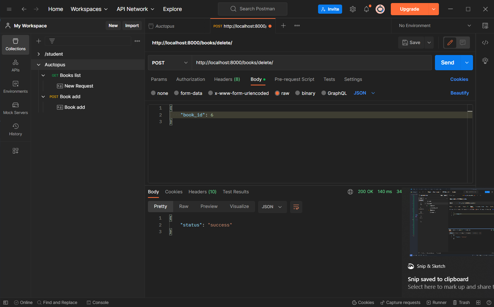

# Backend on DjangoRestFramewrok 💯
Use following command to install required code
> pip install -r requirements.txt

After all installation to start the frontedn use following commad
> python manage.py runserver

# Tested with Postman 📩

